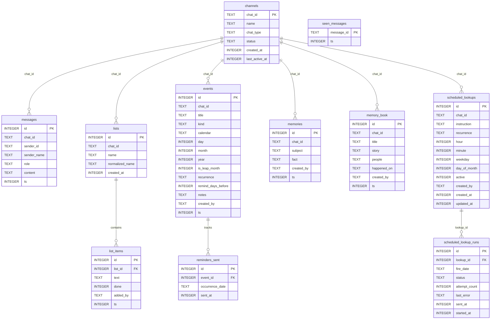

# Family Bot (Zalo Bot)

Trợ lý ảo thông minh, thân thiện dành riêng cho nhóm chat gia đình trên Zalo. Bot được xây dựng trên nền tảng Node.js 22, TypeScript, SQLite, Fastify và tích hợp mô hình ngôn ngữ lớn (Gemini 3.8 Flash / DeepSeek) thông qua Vercel AI SDK với khả năng tự động gọi công cụ (Function Calling / Tool Calling).

---

## 🌟 What ZaloBot Can Do (Khả năng & Tính năng)

ZaloBot đóng vai trò là một thành viên hỗ trợ đa năng trong gia đình với các khả năng cốt lõi:

### 1. 🤖 Trò chuyện & Tương tác thông minh
- **Kích hoạt khi cần:** Phản hồi tự động khi được nhắc tên (`@bot`) hoặc khi có thành viên trong nhóm trả lời (`reply`) tin nhắn của bot.
- **Phong cách thân thiện:** Giọng điệu ấm áp, tự nhiên, gần gũi như người trong gia đình; ngôn ngữ mặc định là tiếng Việt (tự động chuyển sang tiếng Anh nếu người dùng chat bằng tiếng Anh).
- **Định dạng hiển thị Zalo:** Tự động định dạng văn bản thuần, không dùng Markdown phức tạp (tránh lỗi hiển thị ký tự thô trên Zalo), hiển thị danh sách dạng bullet (`•`) hoặc số thứ tự rõ ràng kèm emoji sinh động.
- **Nhận diện ngữ cảnh:** Lưu trữ lịch sử 20 lượt trò chuyện gần nhất, ghi nhận tên người gửi (Bố, Mẹ, Con...) để hiểu đúng ngữ cảnh và xưng hô chuẩn xác.

### 2. 📝 Quản lý danh sách dùng chung (Shared Lists)
- Tạo và quản lý nhiều danh sách khác nhau trong nhóm chat (ví dụ: *Đi chợ*, *Việc nhà*, *Đồ chuẩn bị đi du lịch*, *Đồ cần mua*...).
- Thêm một hoặc nhiều món cùng lúc vào danh sách.
- Đánh dấu hoàn thành (`[x]`) hoặc chưa hoàn thành (`[ ]`).
- Xóa món hoặc xem toàn bộ danh sách một cách trực quan, rõ ràng.

### 3. 📅 Quản lý Sự kiện & Nhắc nhở Âm / Dương lịch (Events & Reminders)
- **Lịch Âm & Dương chuẩn xác:** Tích hợp thuật toán chuyển đổi Âm lịch Việt Nam (múi giờ UTC+7, thiên văn Hồ Ngọc Đức), hỗ trợ chính xác cả năm nhuận và tháng nhuận.
- **Đa dạng loại sự kiện:** Quản lý ngày giỗ chạp (`gio`), sinh nhật (`birthday`), lịch hẹn khám bệnh (`appointment`), ngày kỷ niệm (`anniversary`), nhắc nhở việc quan trọng (`reminder`).
- **Tần suất lặp lại (Recurrence):** Tự động tính toán ngày kế tiếp cho các sự kiện định kỳ hàng năm (`yearly`), hàng tháng (`monthly`), hàng tuần (`weekly`), hàng ngày (`daily`), hoặc diễn ra một lần (`none`).
- **Nhắc nhở trước N ngày:** Cài đặt số ngày cần nhắc trước (`remindDaysBefore`) để gia đình chuẩn bị chu đáo (mua sắm đồ cúng giỗ, quà sinh nhật...).

### 4. 🇻🇳 Tra cứu & Đồng bộ Ngày lễ Việt Nam (Vietnamese Holidays)
- **Dữ liệu đầy đủ:** Cập nhật toàn bộ các ngày nghỉ lễ chính thức theo Bộ luật Lao động (Tết Nguyên Đán, Giỗ Tổ Hùng Vương, 30/4 - 1/5, Quốc khánh 2/9, Tết Dương lịch) cùng số ngày nghỉ quy định.
- **Lễ hội truyền thống:** Tra cứu các ngày lễ phong tục cổ truyền (Tết Trung Thu, Lễ Vu Lan, Tết Hàn Thực, Tết Đoan Ngọ, Tết Ông Công Ông Táo...).
- **Đồng bộ tự động:** Tính năng nhập tự động các ngày lễ vào lịch sự kiện của nhóm chat chỉ bằng một câu lệnh.

### 5. 🔍 Tìm kiếm thông tin thời gian thực (Real-time Web Search)
- Tích hợp công cụ tìm kiếm Tavily Search để tra cứu thông tin thời gian thực trên Internet: thời tiết hôm nay, giá cả thị trường, tin tức nóng, kết quả thể thao, công thức nấu ăn...
- Tổng hợp thông tin ngắn gọn, súc tích kèm nguồn tham khảo khi cần.

### 6. ⏰ Nhắc nhở & Điểm tin tự động (Scheduled Messages)
- **Bản tin buổi sáng (07:00):** Điểm tin ngày mới, sự kiện hôm nay, các ngày lễ hoặc sinh nhật/ngày giỗ sắp diễn ra trong 7 ngày tới.
- **Tổng kết tuần (Chủ nhật 20:00):** Tổng hợp lịch trình, kế hoạch và các việc cần chú ý cho tuần tới.
- **Thông báo nhắc hẹn (08:00):** Gửi tin nhắn thông báo đúng ngày diễn ra sự kiện hoặc trước N ngày theo cài đặt.
- **Chống gửi lặp (Idempotent):** Ghi nhận trạng thái đã gửi vào SQLite để đảm bảo không bao giờ spam hay gửi trùng lặp khi khởi động lại ứng dụng.

### 7. 🛡️ An toàn, Tin cậy & Hiệu năng cao
- **Acknowledge tức thì (Fast ack):** Phản hồi Webhook 200 OK ngay lập tức (< 200ms) để không bị Zalo timeout, sau đó xử lý bất đồng bộ qua hàng đợi.
- **Chống trùng lặp (Deduplication):** Lưu trữ mã tin nhắn (`message_id`) vào cơ sở dữ liệu để loại bỏ tin nhắn gửi lặp khi mạng chập chờn.
- **Bảo mật Webhook:** Xác thực mã token bí mật `X-Bot-Api-Secret-Token` qua so sánh thời gian cố định (`timingSafeEqual`).
- **Hiệu ứng gõ (Typing Indicator):** Tự động gửi trạng thái đang gõ phím (`sendChatAction: typing`) để người dùng trong nhóm biết bot đang xử lý câu trả lời.

---

## 🛠️ Table of Tools (Bảng tra cứu công cụ của Bot)

Dưới đây là bảng tổng hợp chi tiết các công cụ (tools) được tích hợp vào mô hình AI để tự động thực thi khi người dùng yêu cầu:

| Tên công cụ (Tool Name) | Nhóm chức năng | Mô tả chức năng | Tham số đầu vào (Parameters) | Ví dụ câu lệnh thực tế |
| :--- | :--- | :--- | :--- | :--- |
| `list_create` | **Danh sách (Lists)** | Tạo một danh sách mới cho nhóm chat. | • `name` *(string, bắt buộc)*: Tên danh sách cần tạo. | *"Tạo cho mình danh sách Đi chợ"*<br>*"Lập danh sách Đồ đi biển"* |
| `list_add_item` | **Danh sách (Lists)** | Thêm một hoặc nhiều mục/món vào danh sách đã có (tự động tạo danh sách nếu chưa có). | • `listName` *(string, bắt buộc)*: Tên danh sách.<br>• `items` *(string[], bắt buộc)*: Mảng các món/việc cần thêm. | *"Thêm thịt bò, cà chua, hành lá vào danh sách Đi chợ"*<br>*"Ghi thêm kem chống nắng vào đồ đi biển"* |
| `list_check_item` | **Danh sách (Lists)** | Đánh dấu một món trong danh sách là đã hoàn thành (`[x]`) hoặc chưa (`[ ]`). | • `listName` *(string, bắt buộc)*: Tên danh sách.<br>• `itemText` *(string, bắt buộc)*: Tên hoặc từ khóa món.<br>• `done` *(boolean, mặc định `true`)*: Trạng thái hoàn thành. | *"Đã mua thịt bò rồi nhé"*<br>*"Check xong cà chua trong danh sách Đi chợ"*<br>*"Bỏ tích món hành lá"* |
| `list_remove_item` | **Danh sách (Lists)** | Xóa bỏ hẳn một món ra khỏi danh sách. | • `listName` *(string, bắt buộc)*: Tên danh sách.<br>• `itemText` *(string, bắt buộc)*: Tên hoặc từ khóa món cần xóa. | *"Xóa cà chua khỏi danh sách Đi chợ"*<br>*"Bỏ món kem chống nắng đi"* |
| `list_show` | **Danh sách (Lists)** | Hiển thị nội dung chi tiết của một danh sách hoặc xem tất cả danh sách hiện có trong nhóm. | • `listName` *(string, tùy chọn)*: Tên danh sách cần xem. Nếu để trống sẽ liệt kê tất cả danh sách. | *"Xem danh sách Đi chợ"*<br>*"Hiện tại nhóm mình có những danh sách nào?"* |
| `event_add` | **Sự kiện & Nhắc nhở (Events)** | Thêm sự kiện, lịch hẹn, sinh nhật, ngày giỗ chạp, nhắc nhở (hỗ trợ cả Dương lịch và Âm lịch). | • `title` *(string, bắt buộc)*: Tên sự kiện.<br>• `kind` *(enum: `event`, `reminder`, `birthday`, `anniversary`, `gio`, `appointment`)*.<br>• `calendar` *(enum: `solar`, `lunar`, mặc định `solar`)*.<br>• `day` *(number, 1–31)*.<br>• `month` *(number, 1–12)*.<br>• `year` *(number, tùy chọn)*.<br>• `isLeapMonth` *(boolean, mặc định `false`)*.<br>• `recurrence` *(enum: `none`, `yearly`, `monthly`, `weekly`, `daily`)*.<br>• `remindDaysBefore` *(number, số ngày nhắc trước)*.<br>• `notes` *(string, tùy chọn)*. | *"Nhắc ngày giỗ ông nội vào ngày 15 tháng 8 âm lịch hàng năm"*<br>*"Thêm sinh nhật Mẹ ngày 24/11 hàng năm, nhắc trước 3 ngày"*<br>*"Hẹn lịch khám mắt ngày 10/10/2026"* |
| `event_list_upcoming` | **Sự kiện & Nhắc nhở (Events)** | Liệt kê các sự kiện, ngày giỗ, sinh nhật sắp tới trong khoảng thời gian xác định. | • `windowDays` *(number, 1–365, mặc định `30`)*: Số ngày tới cần tìm. | *"Sắp tới có sự kiện hay ngày giỗ nào không?"*<br>*"Xem lịch sinh nhật trong 60 ngày tới"* |
| `event_update` | **Sự kiện & Nhắc nhở (Events)** | Cập nhật thông tin chi tiết của một sự kiện/lịch hẹn đã lưu thông qua ID. | • `id` *(number, bắt buộc)*: ID của sự kiện.<br>• Các trường tùy chọn cập nhật: `title`, `kind`, `calendar`, `day`, `month`, `year`, `recurrence`, `remindDaysBefore`, `notes`. | *"Đổi lịch khám mắt ID 3 sang ngày 15/10"*<br>*"Chỉnh sự kiện số 2 nhắc trước 5 ngày"* |
| `event_delete` | **Sự kiện & Nhắc nhở (Events)** | Xóa bỏ một sự kiện/lịch hẹn khỏi cơ sở dữ liệu theo ID. | • `id` *(number, bắt buộc)*: ID của sự kiện cần xóa. | *"Xóa sự kiện ID 4"*<br>*"Hủy nhắc nhở số 2 giúp mình"* |
| `holiday_list_upcoming`| **Ngày lễ Việt Nam (Holidays)** | Tra cứu các ngày nghỉ lễ chính thức hoặc lễ hội truyền thống sắp tới tại Việt Nam. | • `windowDays` *(number, 1–365, mặc định `365`)*: Khoảng thời gian tra cứu.<br>• `publicOnly` *(boolean, mặc định `false`)*: Chỉ lọc các ngày nghỉ lễ chính thức hưởng nguyên lương theo luật. | *"Sắp tới có ngày nghỉ lễ nào không?"*<br>*"Năm nay Tết Nguyên Đán rơi vào ngày nào dương lịch?"*<br>*"Bao giờ đến Tết Trung Thu?"* |
| `holiday_import` | **Ngày lễ Việt Nam (Holidays)** | Tự động thêm các ngày nghỉ lễ chính thức hoặc toàn bộ lễ hội truyền thống vào lịch sự kiện của nhóm. | • `includeTraditional` *(boolean, mặc định `false`)*: `true` nếu muốn thêm cả các lễ truyền thống (Trung Thu, Vu Lan, Ông Táo...). | *"Lưu các ngày nghỉ lễ năm nay vào lịch nhóm"*<br>*"Nhập tất cả ngày lễ truyền thống vào lịch"* |
| `web_search` | **Tìm kiếm Web (Search)** | Tìm kiếm thông tin thời gian thực từ Internet qua Tavily Search API. | • `query` *(string, bắt buộc)*: Từ khóa hoặc câu hỏi cần tra cứu.<br>• `maxResults` *(number, 1–5, mặc định `3`)*: Số kết quả tối đa cần trả về. | *"Thời tiết Đà Lạt cuối tuần này thế nào?"*<br>*"Giá vàng hôm nay bao nhiêu?"*<br>*"Tìm công thức nấu bò kho ngon"* |
| `lookup_schedule_create` | **Lịch tra cứu định kỳ (Lookups)** | Đặt lịch tra cứu thông tin Internet định kỳ hàng ngày, hàng tuần hoặc hàng tháng (ví dụ: báo thời tiết mỗi sáng, cập nhật giá vàng). Tự động dùng 07:00 nếu yêu cầu buổi sáng không nói giờ cụ thể. Tháng ngắn hơn tự động chuyển về ngày cuối tháng. | • `instruction` *(string, bắt buộc)*: Nội dung tra cứu.<br>• `recurrence` *(enum: `daily`, `weekly`, `monthly`)*.<br>• `time` *(string, định dạng HH:mm)*.<br>• `isMorning` *(boolean)*.<br>• `weekday` *(number, 0–6 cho weekly)*.<br>• `dayOfMonth` *(number, 1–31 cho monthly)*. | *"Mỗi ngày lúc 7:00 sáng báo thời tiết TP.HCM"*<br>*"Hàng ngày 08:30 cập nhật giá vàng SJC"*<br>*"Sáng thứ 2 hàng tuần lúc 08:00 điểm tin tài chính"* |
| `lookup_schedule_list` | **Lịch tra cứu định kỳ (Lookups)** | Xem danh sách các lịch tra cứu Internet định kỳ hiện có trong nhóm chat kèm trạng thái và kết quả lần chạy gần nhất. | Không có tham số. | *"Xem danh sách lịch tra cứu của nhóm"*<br>*"Nhóm mình đang có những lịch hẹn tra cứu nào?"* |
| `lookup_schedule_update` | **Lịch tra cứu định kỳ (Lookups)** | Cập nhật chỉ dẫn, giờ thực hiện hoặc tạm dừng/bật lại một lịch tra cứu định kỳ theo ID. | • `id` *(number, bắt buộc)*.<br>• Các trường tùy chọn: `instruction`, `recurrence`, `time`, `weekday`, `dayOfMonth`, `active`. | *"Đổi lịch tra cứu số 1 sang 07:30"*<br>*"Tạm dừng lịch tra cứu ID 2"* |
| `lookup_schedule_cancel` | **Lịch tra cứu định kỳ (Lookups)** | Hủy và xóa hoàn toàn một lịch tra cứu định kỳ khỏi nhóm chat theo ID. | • `id` *(number, bắt buộc)*: ID của lịch tra cứu cần hủy. | *"Hủy lịch tra cứu số 3"*<br>*"Xóa lịch báo thời tiết ID 1"* |

---

## 🏗️ Kiến trúc & Công nghệ (Tech Stack)

- **Ngôn ngữ & Runtime:** Node.js 22 (LTS), TypeScript (Strict Mode), ESM module.
- **Giao thức Zalo:** Webhook API chính thức của Zalo (`zalo-bot-js` & Fastify Webhook Handler).
- **Cơ sở dữ liệu:** libSQL / Turso client (`@libsql/client`), hỗ trợ cả database SQLite cục bộ (`file:...`) và cloud distributed Turso database (`libsql://...` hoặc `https://...`).
- **Âm lịch Việt Nam:** Thư viện tính toán thiên văn dựa trên thuật toán Hồ Ngọc Đức, múi giờ GMT+7, hỗ trợ đầy đủ các chu kỳ tháng nhuận và năm nhuận.
- **Tìm kiếm thời gian thực:** `@tavily/core` API client.
- **Lập lịch (Scheduling):** In-process scheduler chạy nền theo múi giờ `Asia/Ho_Chi_Minh`.
- **Triển khai (Deployment):** Docker (Node 22-slim), Docker Compose, tương thích hoàn hảo với nền tảng Dokploy.

---

## 🗄️ Sơ đồ thực thể–quan hệ (ERD)

SQLite (`/data/family.db`) lưu dữ liệu theo nhóm chat. `channels.chat_id` là khóa logic của hầu hết bảng. Chỉ `list_items.list_id` và `reminders_sent.event_id` là khóa ngoại khai báo (`ON DELETE CASCADE`). `seen_messages` đứng riêng để chống xử lý trùng webhook.



---

## ⚙️ Cấu hình môi trường (.env)

Tạo file `.env` (tham khảo file mẫu `.env.example`) với các thông số cấu hình:

| Biến môi trường | Bắt buộc | Mặc định | Ý nghĩa & Mô tả |
| :--- | :---: | :---: | :--- |
| `ZALO_BOT_TOKEN` | **Có** | — | Bot Token do Zalo cung cấp khi tạo bot trên Zalo Bot Platform. |
| `WEBHOOK_URL` | **Có** | — | Địa chỉ HTTPS công khai dẫn tới endpoint webhook, ví dụ: `https://bot.example.com/webhooks/zalo`. |
| `WEBHOOK_SECRET` | **Có** | — | Chuỗi bí mật ngẫu nhiên (từ 8 đến 256 ký tự) dùng để ký và xác thực webhook. |
| `MODE` | **Có** | `webhook` | Chế độ chạy: `webhook` (chế độ chính thức cho môi trường production). |
| `PORT` | Không | `3000` | Cổng HTTP server lắng nghe bên trong container. |
| `FAMILY_CHAT_IDS` | Không | `""` | Danh sách các `chat.id` của nhóm gia đình được phục vụ (phân cách bằng dấu phẩy). |
| `FAMILY_CHAT_ID` | Không | `""` | ID đơn lẻ của nhóm gia đình (hỗ trợ tương thích ngược). Nếu để trống, bot chạy ở chế độ **Discovery Mode**. |
| `LLM_PROVIDER` | Không | Tự nhận diện | Nhà cung cấp AI: `gemini` hoặc `deepseek`. Tự động suy luận dựa trên API Key cung cấp. |
| `GEMINI_API_KEY` | Tùy chọn | — | API key của Google AI Studio (nếu dùng provider Gemini). |
| `GEMINI_MODEL` | Không | `gemini-3.8-flash` | Tên mô hình Gemini sử dụng. |
| `DEEPSEEK_API_KEY`| Tùy chọn | — | API key của DeepSeek (nếu dùng provider DeepSeek). |
| `DEEPSEEK_MODEL` | Không | `deepseek-chat` | Tên mô hình DeepSeek (khuyến nghị dùng bản chat, không dùng reasoner). |
| `TAVILY_API_KEY` | Tùy chọn | — | API key của Tavily Search dùng cho công cụ tìm kiếm web thời gian thực `web_search`. |
| `DB_PATH` | Không | `/data/family.db` | Đường dẫn tới file SQLite database (gắn với volume Docker `/data`). |
| `TZ` | Không | `Asia/Ho_Chi_Minh` | Múi giờ hệ thống (khuyến nghị giữ nguyên giờ Việt Nam). |

---

## 🚀 Hướng dẫn Triển khai trên Dokploy (Docker Compose)

### Bước 1: Khởi tạo Project trên Dokploy
1. Trong giao diện quản trị Dokploy, chọn **Create Project** -> **Docker Compose**.
2. Kết nối tới Git repository này.
3. Cấu hình volume lưu trữ dữ liệu bền vững: Docker Compose đã định nghĩa sẵn named volume `bot-data` gắn vào `/data`.

### Bước 2: Cài đặt Biến môi trường (Environment Variables)
Trong mục **Environment** của Dokploy, điền các giá trị từ file mẫu `.env.example`:
- Để trống `FAMILY_CHAT_IDS` ở lần chạy đầu tiên.
- Đặt `WEBHOOK_SECRET` là một chuỗi ngẫu nhiên an toàn (tối thiểu 16 ký tự).
- Cung cấp `GEMINI_API_KEY` (hoặc `DEEPSEEK_API_KEY`) và `TAVILY_API_KEY`.

### Bước 3: Cấu hình Tên miền (Domain & Traefik SSL)
1. Trong mục **Domains**, thêm domain của bạn (ví dụ `bot.example.com`).
2. Chọn Service Name là `bot`, Container Port là `3000`.
3. Bật tùy chọn **HTTPS** (Dokploy tự động cấp chứng chỉ Let's Encrypt SSL miễn phí).
4. Điền `WEBHOOK_URL` trong biến môi trường đúng bằng: `https://bot.example.com/webhooks/zalo`.

### Bước 4: Deploy & Lấy Family Chat ID (Discovery Mode)
1. Bấm **Deploy**.
2. Kiểm tra Logs của container để xác nhận bot đã khởi động thành công và tự động đăng ký Webhook với Zalo qua API `setWebhook`.
3. Trong nhóm Zalo gia đình, hãy mời bot vào nhóm và gửi một tin nhắn nhắc tên bot: `@FamilyBot xin chào`.
4. Mở Logs trên Dokploy: Bạn sẽ thấy dòng log ghi nhận tin nhắn đến kèm thông tin `chat.id` của nhóm (loại `chat_type: GROUP`).
5. Sao chép ID đó và cập nhật vào biến môi trường `FAMILY_CHAT_IDS` (hoặc `FAMILY_CHAT_ID`) trên Dokploy, sau đó bấm **Redeploy**. Từ lúc này, bot chỉ phản hồi nhóm gia đình của bạn.

---

## 💻 Phát triển cục bộ & Kiểm thử (Local Development)

```bash
# 1. Cài đặt dependencies
pnpm install

# 2. Kiểm tra Typescript và build dự án
pnpm build

# 3. Chạy toàn bộ test suites
pnpm test

# 4. Chạy kiểm tra riêng từng nhóm công cụ
pnpm test src/tools/lists.test.ts
pnpm test src/tools/events.test.ts
pnpm test src/tools/holidays.test.ts
```

---

## 🔒 Xử lý sự cố thường gặp (Troubleshooting)

- **Webhook trả về lỗi 401 Unauthorized:** Kiểm tra xem `WEBHOOK_SECRET` trên Dokploy có khớp với secret được đăng ký tại Zalo hay không.
- **Bot không phản hồi trong nhóm:**
  - Nhóm chat trên Zalo yêu cầu phải tag `@bot` hoặc ấn **Reply** vào tin nhắn của bot để bot nhận được webhook.
  - Kiểm tra xem `FAMILY_CHAT_IDS` có chứa đúng `chat.id` của nhóm hay không.
- **Lỗi hết quota / Rate Limit:** Bot được thiết kế để giữ câu trả lời ngắn gọn, súc tích nhằm tiết kiệm hạn ngạch tin nhắn miễn phí của Zalo Official Account.
- **Dữ liệu danh sách hoặc sự kiện bị mất sau khi redeploy:** Đảm bảo container đang dùng named volume `bot-data` mount vào thư mục `/data` theo đúng file `docker-compose.yml`.
